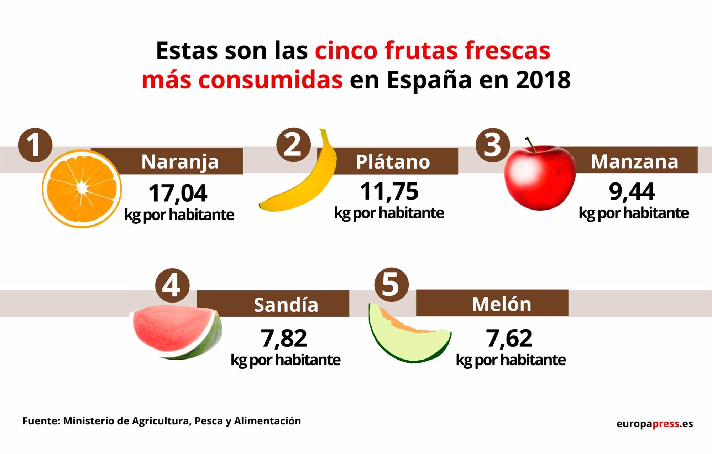

# Uso de bibliotecas JavaScript

Queremos crear una app para mostrar en gráficos las frutas más consumidas en España. Para ello, nos hemos valido de la biblioteca o librería [Chart.js](https://www.chartjs.org/)

Estas son las frutas más consumidas en España en el 2018:

## Ejercicios

1. Como puedes apreciar, nos falta añadir el melón. Modifica el objeto de configuración para añadirlo 
2. Nos han pedido que en vez de un gráfico de pastel, lo cambiemos a un gráfico de barras.
4. DIFÍCIL. De todas estas frutas, se produce al año 8 kg de frutas por persona. Modifica la función de callback del _tooltip_ para que añada esta información.

